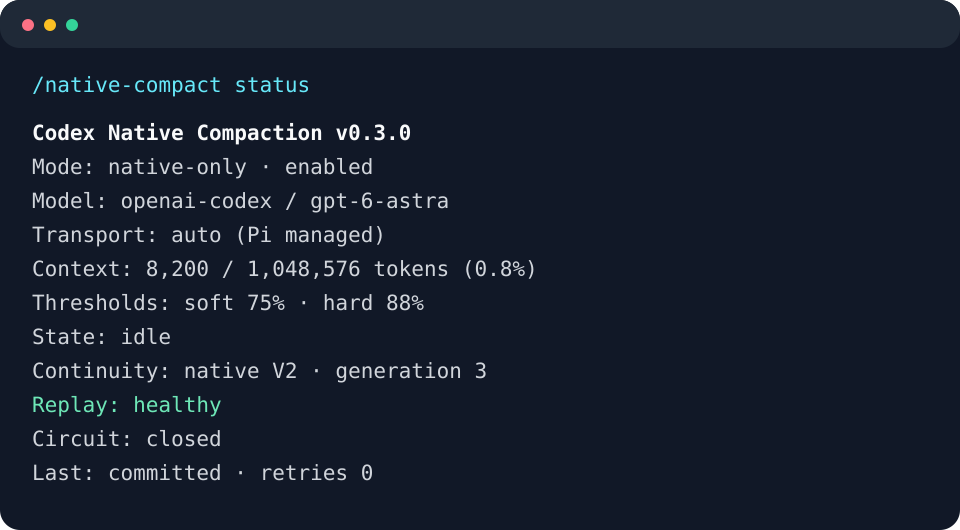

# pi-codex-native-compaction

[](https://github.com/jacek4yang/pi-codex-native-compaction/actions/workflows/ci.yml)
[](LICENSE)
[](package.json)
[](docs/TESTING.md)

Provider-native **Codex Remote Compaction V2** for Pi 1.0. An independent implementation,
not a fork of `pi-better-compaction`.

Pi owns serialization, authentication and transport. This extension appends a
`compaction_trigger` to the normal Codex Responses request, validates the complete
response, and stores the opaque encrypted checkpoint in Pi's session JSONL.
Subsequent requests replace Pi's structural summary with retained native messages,
the encrypted item, and the new live tail. **There is no text-summary fallback.**

## Compatibility and evidence

- Tested: `@earendil-works/pi-coding-agent` **1.0.0**, `@earendil-works/pi-ai` **1.0.0**.
  Runtime compatibility is deliberately restricted to **1.0.x**. Host dependencies are
  external peers (`*`), following Pi package guidance; the runtime guard is not relaxed.
- Provider/API: `openai-codex` / `openai-codex-responses`; primary model `gpt-6-astra`.
- Existing Pi ChatGPT/Codex OAuth login; no API key, second login, or billing fallback.
- Codex reference: `ca466061d64f0b44f416135c7fd06aa7af850bbc`.
- Pi upstream inspected: `b271b0a524b29e13c0c9e748aea0d34e1597f2db`.
- Offline: actual Pi SDK, local SSE backend, serializer parity and fault injection.
- Live: **six consecutive V2 generations**, real normal/custom grammar tools,
  encrypted JSONL checkpoints, coherent replay after every generation and after restart.
  WebSocket, cached WebSocket and auto also each passed three native generations,
  with connection reuse/reconnect and zero SSE fallback; separate-process resume passed.
  See [testing evidence](docs/TESTING.md).

Behaviorally aligned with Codex Remote Compaction V2, **not byte-for-byte parity**.
Read the [intentional differences](docs/PROTOCOL.md) before deployment.

Independent summarizers such as Luna do not inherit the main Astra checkpoint.
See [request ownership and pruner compatibility](docs/PRUNER_OWNERSHIP.md).
No companion plugin is bundled or required. The optional boundary/retry enhancements
in those notes belong to a separately tested local pruner patch.

## Install from GitHub

Requires Node **24+**, Pi **1.0.x**, and your existing Codex login.

```sh
pi install git:github.com/jacek4yang/pi-codex-native-compaction
```

For a reproducible release (recommended; the unpinned form tracks the default branch):

```sh
pi install git:github.com/jacek4yang/pi-codex-native-compaction@v0.3.1
```

Reload/restart Pi after installation. The root TypeScript entry works without a local
build and displays the package name rather than `dist`. Do not install both a local
checkout and the Git source simultaneously.

To try without saving the package to settings:

```sh
pi -e git:github.com/jacek4yang/pi-codex-native-compaction
```

Development checkout instructions are in [CONTRIBUTING.md](CONTRIBUTING.md).

Disable/remove any other compaction owner first. Version **0.2.0** adds explicit old-session
migration: `/native-compact migrate`. Existing native sessions require this extension
to resume safely. See [migration boundaries and limitations](docs/MIGRATION.md).

**GitHub-first release:** npm and the Pi package gallery are not published yet.
The manifest is prepared for those later stages; see [RELEASING.md](docs/RELEASING.md).
`npm pack` prepares an installable archive, not an npm publication.

## Configuration

No configuration is required. The minimal explicit configuration is:

```sh
export PI_CODEX_NATIVE_COMPACTION='{"mode":"native-only"}'
```

Set this before launching Pi. All settings are validated; unknown keys are rejected.

| Setting                            |                   Default |
| ---------------------------------- | ------------------------: |
| enabled                            |                      true |
| mode                               |               native-only |
| softThresholdRatio                 |                      0.75 |
| hardThresholdRatio                 |                      0.88 |
| maxRetries                         |  2 (three total attempts) |
| retryBaseDelayMs / retryMaxDelayMs |               250 / 10000 |
| retryJitterRatio                   |                       0.2 |
| circuitBreakerFailureCount         |       3 failed operations |
| circuitBreakerCooldownMs           |                     60000 |
| debug                              |                     false |
| artifactRoot                       | empty (no artifact files) |

`enabled:false` suspends new native compactions, **not** checkpoint replay/integrity
checks, and does not enable textual fallback. Remove the extension and start a new
session to restore Pi's default compaction.

## Commands

```text
/native-compact status
/native-compact inspect
/native-compact status --json
/native-compact now
/native-compact retry
/native-compact migrate
```

`status` is a compact human-readable summary; `inspect` expands safe diagnostic metadata.
Use `status --json` (or `inspect --json`) explicitly for machine-readable output.
No command dumps encrypted content.
`retry` requests another manual attempt but respects an open circuit.
Pi's ordinary `/compact` also uses native V2. Custom summary instructions are not
translated into a different protocol.



The preview is illustrative, not a claim about your current context usage.
Status shows identity, usage, thresholds, state, generation, last native response,
failure/retry count, circuit, scheduler and replay health. Session continuity is
explicitly native, uncompacted, legacy-text, legacy-codex-v2, or invalid. Migrated
checkpoints retain their source/scope provenance through every subsequent generation.

## Automatic operation

At safe `turn_end` / `agent_before_settle` boundaries, approximately 75% usage
schedules native compaction. No active tool is interrupted. Pi commits the boundary
and continues naturally; there is no synthetic user message or abort/resume loop.

Transient failure preserves history, waits for a later boundary and allows work below
88%. At the hard threshold another normal provider request is blocked until a native
checkpoint succeeds. A deterministic compatibility failure latches automatic attempts
until a successful manual attempt or a new session.

Pi overflow recovery uses `session_before_compact`; Pi, not the extension, retries
the failed turn. See [Pi integration](docs/PI_INTEGRATION.md).

## Failure, network and crash safety

- DNS/reset/timeout/early EOF, 408, 429 and selected 5xx: bounded backoff and jitter.
- Retry-After is honored within the wait budget; longer delays stop rather than retry early.
- Invalid schema, 400, 401, 403, identity mismatch and invalid checkpoints: fail closed.
- A compaction item followed by EOF is **not** success.
- No session entry is written during the remote request.
- The branch/model/tool generation is checked again immediately before Pi's append.
- Successful JSONL appends recover on restart. Pi's append mechanism is not fsync-based;
  power-loss and disk-full atomicity are **not** promised. See [failure model](docs/FAILURE_MODEL.md).
- No independent transport, OAuth implementation, endpoint discovery or proxy configuration.

SDK/Node users relying on environment proxies may need `NODE_USE_ENV_PROXY=1`.
Use your existing proxy environment; the extension contains no proxy ports.

## Diagnostics and privacy

```sh
export PI_CODEX_NATIVE_COMPACTION='{"mode":"strict-debug","artifactRoot":"/absolute/private/native-debug"}'
```

Structured JSONL logs contain phases, counts, hashes, event types, failures/status,
retries, response IDs and replay outcomes. Nested credentials and credential-like
strings are redacted. Prompts, tool output, payload bodies and encrypted blobs are
not dumped even in debug mode. `debug:true` enables the same metadata artifacts
without changing failure policy. Artifact failures cannot affect checkpoint correctness.

Session JSONL **does** contain opaque encrypted provider state and retained user text,
just as ordinary sessions contain conversation history. Protect session files normally.

## Troubleshooting and limitations

- **Legacy textual checkpoint:** run `/native-compact migrate` once. Existing summary
  and visible tail are used as the starting point; earlier discarded information is
  **not** recovered. Normal `/compact` and automatic scheduling never migrate silently.
- **Model/provider/base URL change or fork:** unsupported across a native boundary.
  Return to the exact identity/original session, or start a new one.
- **Manual compaction before any request / immediately after resume:** run one ordinary
  turn first if Pi has not yet established a system/tool transcript.
- **Unsupported Pi API shape:** use tested Pi 1.0.0. Do not edit checkpoints to bypass guards.
- **Input-rewriting extensions:** arbitrary provider-input rewrites cannot be safely
  reproduced by the compaction request and are rejected. Non-input payload policy
  changes are retained. Competing provider overrides are unsupported.
- **Circuit open:** wait for cooldown; `retry` does not hammer the backend.
- **Stale/cancelled:** old history remains authoritative; retry at a stable boundary.
- No cross-process locking of the same session file; do not open it in two writers.
- Exact Pi versions, remaining coverage limits and transport-terminal behavior are in
  [TESTING.md](docs/TESTING.md).

## Migration and rollback

Do not run `pi-better-compaction` and this extension together. Disable/remove the former
through the same Pi package/extension configuration used to install it; no package
is automatically deleted. A command-source-based detection warns and disables native
operation when its package name is visible, but cannot detect renamed copies.

In the old session, run `/native-compact status`, then `/native-compact migrate`.
Supported inputs are Pi textual summaries (including old text fallbacks) and the audited
`pi-better-compaction` Codex V2 window format. Migration makes a fresh V2 request and
commits a new checkpoint only on success; subsequent `/compact` and automatic compaction
are native. Unknown/V1/corrupt native formats and unsupported retained items are refused.
No real user session is migrated automatically during installation.

This project does not reuse its serializer or summary format. Built-in Pi compaction
stores a textual summary; this project stores a native protocol checkpoint and only a
structural sentinel: `[Codex Remote Compaction V2 checkpoint]`.

To remove the GitHub installation:

```sh
pi remove git:github.com/jacek4yang/pi-codex-native-compaction
unset PI_CODEX_NATIVE_COMPACTION
```

If installed with a tag, use the exact source shown by `pi list`, for example
`pi remove git:github.com/jacek4yang/pi-codex-native-compaction@v0.3.0`.
For an old local-checkout installation, remove its local path instead.

Then start a **new session** for default textual compaction. Do not resume a native
checkpoint without this extension: Pi alone sees only its structural sentinel.
For old context, keep a backup of the JSONL and branch before the native checkpoint
while the extension is still installed, or reinstall this extension. Never delete
encrypted checkpoint fields as a rollback technique.

## Development

`npm run check`: strict TypeScript, ESLint, build, unit/fault/real-SDK tests.
`npm run live`: bounded existing-OAuth validation in a private temporary session.
`PI_NATIVE_LIVE_TOOLS=1 PI_NATIVE_LIVE_GENERATIONS=6 npm run live`: tool-enabled soak.
`PI_NATIVE_LIVE_TRANSPORT=auto PI_NATIVE_LIVE_TOOLS=1 npm run live`: prove cached
WebSocket compaction/replay with HTTP/SSE fallback blocked during validation.

Maintained by [Jacek Yang](https://github.com/jacek4yang). MIT licensed.
Independent project; not affiliated with OpenAI or the Pi maintainers.
See [changelog](CHANGELOG.md), [contributing](CONTRIBUTING.md), [security](SECURITY.md),
and [community conduct](CODE_OF_CONDUCT.md).

Architecture: [overview](docs/ARCHITECTURE.md), [protocol](docs/PROTOCOL.md),
[failure model](docs/FAILURE_MODEL.md), [Pi lifecycle](docs/PI_INTEGRATION.md).
